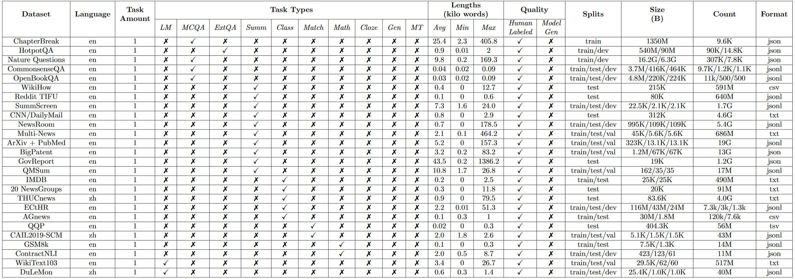
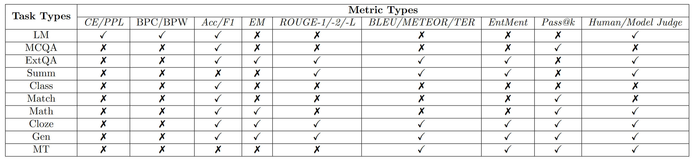

| 名称 | url                                                          | 描述                                                         | related paper | tag                |
| ---- | ------------------------------------------------------------ | ------------------------------------------------------------ | ------------- | ------------------ |
| MSC  | [MemGPT/MSC-Self-Instruct · Datasets at Hugging Face](https://huggingface.co/datasets/MemGPT/MSC-Self-Instruct) | contains multi-session chat logs generated by human labelers, each of whom was asked to play a consistent persona for the duration of all sessions. Each multisession chat in MSC has five total sessions, and each session consists of a roughly a dozen messages. | MemGPT        | Multi-Session Chat |

以上表格待补充完全：

长上下文数据集：

常用指标：

